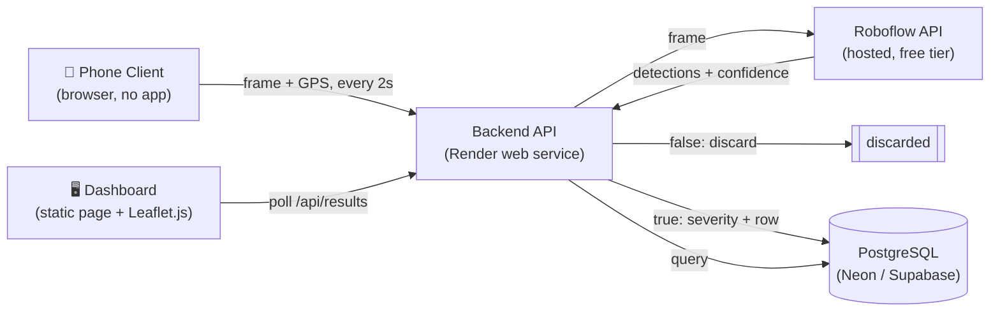

# 00 — Project Overview

## What this is
A demo-scale pothole detection system. A phone captures road frames + GPS while moving; a backend service runs each frame through a pothole-detection model; confirmed detections (with severity) are stored in a cloud database; a web dashboard shows them on a map for a "road authority" style viewer.

## Problem statement
Manual pothole reporting is slow and inconsistent. This project proves out an automated pipeline: capture → detect → store → visualize, using only free-tier tools, sized for a short live demo rather than production traffic.

## Goals (v1 — demo scope)
- Capture frames + GPS from a phone browser, no native app.
- Run each frame through a pothole detection model (Roboflow hosted API).
- Store only positive detections (image, GPS, severity, timestamp) in a cloud database.
- Show all detections on a map dashboard (Leaflet.js), colored by severity, with a list view.
- Run reliably for two ~10-minute live sessions at two different locations.

## Non-goals (out of scope for v1)
- Deduplicating repeated detections of the same physical pothole.
- Reverse-geocoding GPS into street addresses.
- Manual review/approval queue before a detection appears on the dashboard.
- Authentication / multi-user access control.
- Long-term data retention or backup strategy.
- Privacy handling (face/plate blurring).

See [08-roadmap.md](./08-roadmap.md) for when these might get picked up.

## Tech stack summary

| Layer | Choice | Why |
|---|---|---|
| Phone client | Plain HTML/JS (`getUserMedia` + `getGeolocation`) | No app install needed for a demo |
| Backend | Python, FastAPI (or Flask) | Simple, fast to stand up, good ecosystem for calling Roboflow |
| Detection model | Roboflow hosted Serverless API | Free tier (10,000 inferences/month) comfortably covers demo volume (~600 calls) |
| Database | PostgreSQL (Neon or Supabase free tier) | Structured, fixed-schema data fits relational well; both have permanent free tiers (unlike Render's Postgres, which expires after 90 days) |
| Dashboard | Static HTML/JS + Leaflet.js | No framework needed, easy to host as a static page |
| Hosting | Render (free web services) | Matches your stated deployment target |

MongoDB is a valid alternative to Postgres if preferred — see [05-database-schema.md](./05-database-schema.md) for both schemas.

## High-level architecture

## Deployment summary
- **Backend**: one Render free web service, exposing all API routes (see [06-api-design.md](./06-api-design.md)). Kept as a single service rather than split Server 1 / Server 2 — simpler to deploy and avoids two independent cold-start delays during a live demo.
- **Database**: Postgres on Neon or Supabase free tier (external to Render, connected via a `DATABASE_URL` env var).
- **Dashboard**: served as static files from the same backend service, or as a separate Render Static Site — either works; static site is simpler if you want the dashboard URL separate from the API URL.
- **Phone capture page**: same options as the dashboard — static HTML served from the backend or a static site.

Full deploy steps: [09-deployment-guide.md](./09-deployment-guide.md).

## Success criteria for the demo
- Phone reliably POSTs frames + GPS every ~2s for the full session without dropped connections.
- Detections appear in the database within a few seconds of capture.
- Dashboard shows pins at (roughly) the correct GPS location, colored by severity, within one polling interval.
- No manual intervention needed once the session starts.
