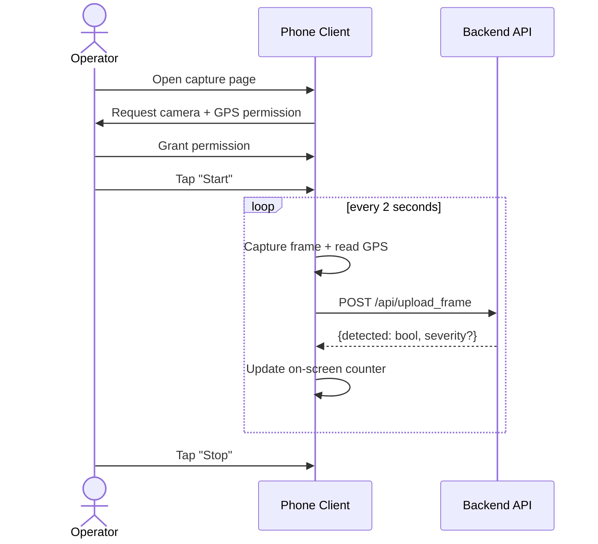
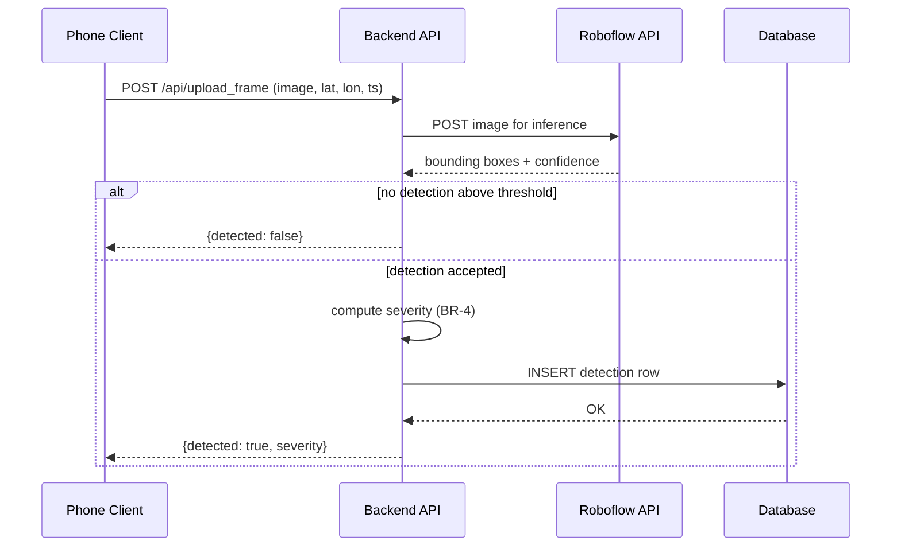
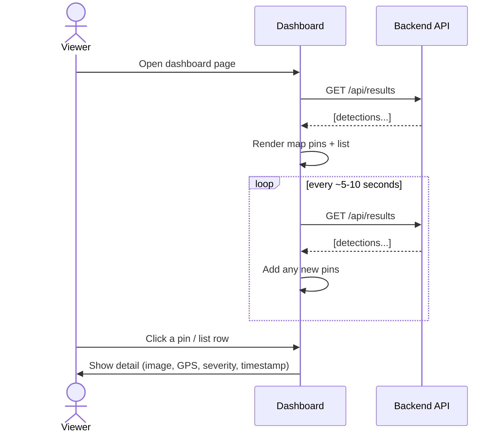

# 03 — User Flows

## Actors
- **Operator** — the person holding/mounting the phone, driving or walking the route during the demo.
- **Viewer** — the person watching the dashboard (could be the same person as the Operator, presenting both sides of the demo).

## Flow 1: Start a capture session

1. Operator opens the phone capture page (a URL, e.g. `https://<app>.onrender.com/capture`).
2. Browser prompts for camera and location permission; Operator grants both.
3. Operator taps "Start".
4. Page begins capturing a frame + GPS reading every 2 seconds and POSTing each to the backend.
5. Page shows a simple running status (e.g. "Sent: 42 | Detected: 3") so the Operator has live feedback without needing to check the dashboard.
6. Operator taps "Stop" at the end of the session (or simply closes the tab).

## Flow 2: Frame processing (backend)

1. Backend receives a frame + GPS + timestamp at `/api/upload_frame`.
2. Backend forwards the image to the Roboflow API.
3. Roboflow returns bounding boxes + confidence scores (or an empty list).
4. Backend applies BR-2 (confidence threshold): if nothing clears it, discard and respond `{detected: false}`.
5. If something clears it: compute severity (BR-4), encode both the original and annotated image as base64, and insert one row into the database.
6. Backend responds `{detected: true, severity: "Medium"}` to the phone.

## Flow 3: View the dashboard

1. Viewer opens the dashboard page (e.g. `https://<app>.onrender.com/dashboard`).
2. Dashboard immediately fetches `GET /api/results` and renders map pins + list.
3. Dashboard polls `GET /api/results` every ~5–10 seconds for new detections and adds any pins not already shown.
4. Viewer clicks a pin or a list row → dashboard opens a popup / detail panel showing the annotated image, GPS, severity, and timestamp for that record (using `GET /api/results/:id` if the list endpoint doesn't already include full image data — see [06-api-design.md](./06-api-design.md) for the tradeoff).
5. Viewer may optionally filter by severity (client-side only, no extra API call needed).

