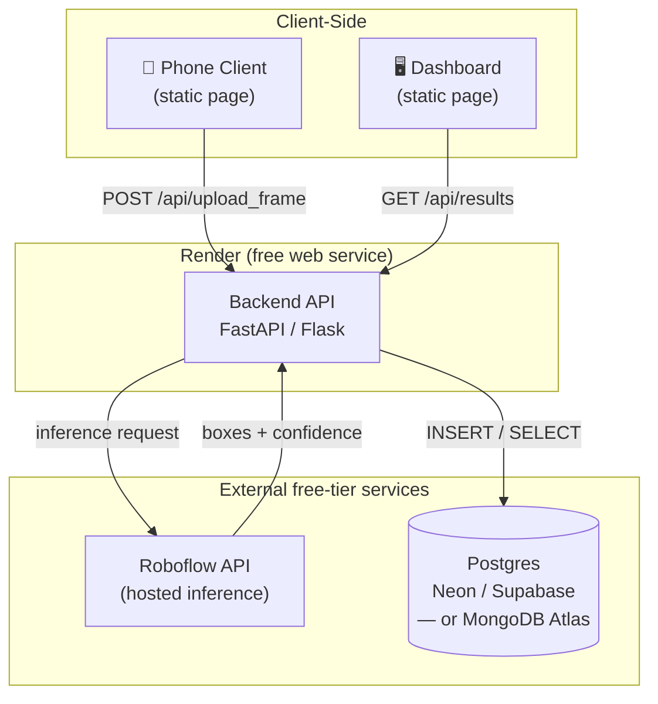
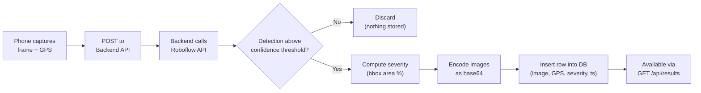

# 04 — System Architecture

## Components and responsibilities

| Component | Responsibility | Hosted as |
|---|---|---|
| Phone Client | Capture frame + GPS every 2s; POST to backend; show live status | Static HTML/JS, served by the backend or a Render Static Site |
| Backend API | Receive frames, call Roboflow, apply severity rules, read/write DB, serve results to dashboard | One Render free web service (Python/FastAPI) |
| Roboflow API | Run the pothole detection model, return bounding boxes + confidence | External (roboflow.com, hosted) |
| Database | Persist detection records | External (Neon/Supabase Postgres, or MongoDB Atlas) |
| Dashboard | Poll backend, render Leaflet map + list | Static HTML/JS, served by the backend or a Render Static Site |

## Why one backend service, not two
An earlier sketch split "Server 1" (detection/ingestion) from "Server 2" (dashboard API). For this deployment, they're merged into a **single Render web service** with two route groups:
- Reasons: two Render free services means two independent cold-start delays to manage during a live demo; at this scale (one operator, one viewer, ~600 requests total) there's no load-separation benefit to splitting them.
- If this ever needs to scale past demo size, splitting back out is a small refactor (move the dashboard routes into their own app/service) rather than a redesign.

## Deployment diagram

## Data flow (per frame)

## Cross-cutting concerns

- **Cold starts**: Render free services sleep after ~15 min idle. Plan a warm-up ping before each demo session (details in [09-deployment-guide.md](./09-deployment-guide.md)).
- **No persistent disk**: images are stored as base64 in the database row, not as files on disk — this is why the free Render tier's ephemeral filesystem isn't a problem here (see BR-7 in [02-business-rules.md](./02-business-rules.md)).
- **CORS**: the phone client and dashboard are static pages that call the backend API from a different-looking origin (or the same one, if served by the backend) — CORS must be enabled on the backend for both the phone-capture origin and dashboard origin. See [06-api-design.md](./06-api-design.md).
- **Secrets**: `ROBOFLOW_API_KEY` and the database connection string are supplied via Render environment variables, never committed to the repo.
- **Single point of failure by design**: for v1, one backend instance, one DB instance — no redundancy. Acceptable for a two-session demo; would need revisiting for anything longer-running (see [08-roadmap.md](./08-roadmap.md)).
